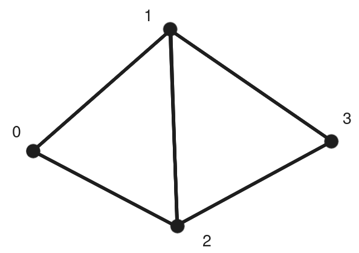

fast-edges-extraction
=====================

Cython implementation of edges extraction from triangles as well as adjacency information (edge degrees and adjacent points/triangles for manifold and boundary edges).

Example
-------




- Extract the edges from the triangles

```python
from fast_edges_extraction import extract_edges

triangles = [
    [0, 1, 2],
    [1, 2, 3],
]

edges = extract_edges(triangles)
print(edges)
```

Out:
```
[[0 1]
 [0 2]
 [1 2]
 [1 3]
 [2 3]]
```

- Also extract adjacency information

```python
# Extract edges, degrees, and adjacency information (triangles and points)
edges, degrees, t_a, p_a = extract_edges(triangles, return_adjacency=True)

# Extract manifold (2 adjacent triangles) and boundary (1 adjacent triangle) edges
manifold_edges = edges[degrees == 2]
boundary_edges = edges[degrees == 1]
other = edges[degrees > 2]

# For each manifold edge, extract the adjacent triangles and points
manifold_adjacent_triangles = t_a[degrees == 2]
manifold_adjacent_points = p_a[degrees == 2]

# For each boundary edge, extract the adjacent triangle and point
boundary_adjacent_triangles = t_a[degrees == 1][:, 0]
boundary_adjacent_points = p_a[degrees == 1][:, 0]

print("Number of manifold edges:", len(manifold_edges))
print("Number of boundary edges:", len(boundary_edges))
print("Number of other edges:", len(other))
print()

print("Manifold edges:\n---------------")

for i in range(len(manifold_edges)):

    adjacent_triangles_indices = manifold_adjacent_triangles[i]
    adjacent_points_indices = manifold_adjacent_points[i]

    adjacent_triangles = [triangles[i] for i in adjacent_triangles_indices]

    print(f"Edge {manifold_edges[i]}, ", end="")
    print(f"adjacent triangles: {adjacent_triangles}, ", end="")
    print(f"adjacent points: {adjacent_points_indices}")

print("\nBoundary edges:\n---------------")

for i in range(len(boundary_edges)):

    adjacent_triangle_indice = boundary_adjacent_triangles[i]
    adjacent_point_indice = boundary_adjacent_points[i]
    adjacent_triangle = triangles[adjacent_triangle_indice]

    print(f"Edge {boundary_edges[i],}", end=" ")
    print(f"adjacent triangles: {adjacent_triangle},", end=" ")
    print(f"adjacent points: {adjacent_point_indice}")
```

Out:
```
Number of manifold edges: 1
Number of boundary edges: 4
Number of other edges: 0

Manifold edges:
---------------
Edge [1 2], adjacent triangles: [[0, 1, 2], [1, 2, 3]], adjacent points: [0 2]

Boundary edges:
---------------
Edge (array([0, 1]),) adjacent triangles: [0, 1, 2], adjacent points: 2
Edge (array([0, 2]),) adjacent triangles: [0, 1, 2], adjacent points: 1
Edge (array([1, 3]),) adjacent triangles: [1, 2, 3], adjacent points: 1
Edge (array([2, 3]),) adjacent triangles: [1, 2, 3], adjacent points: 0
```
